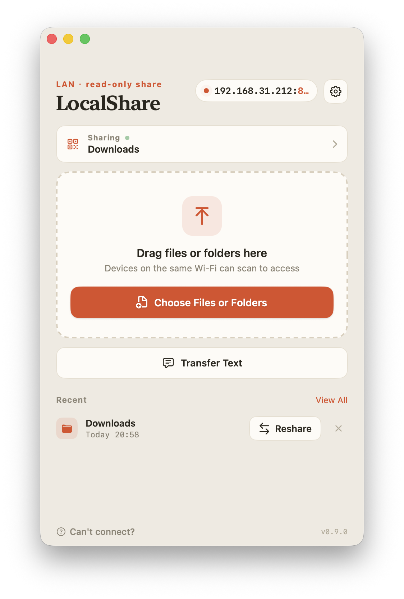
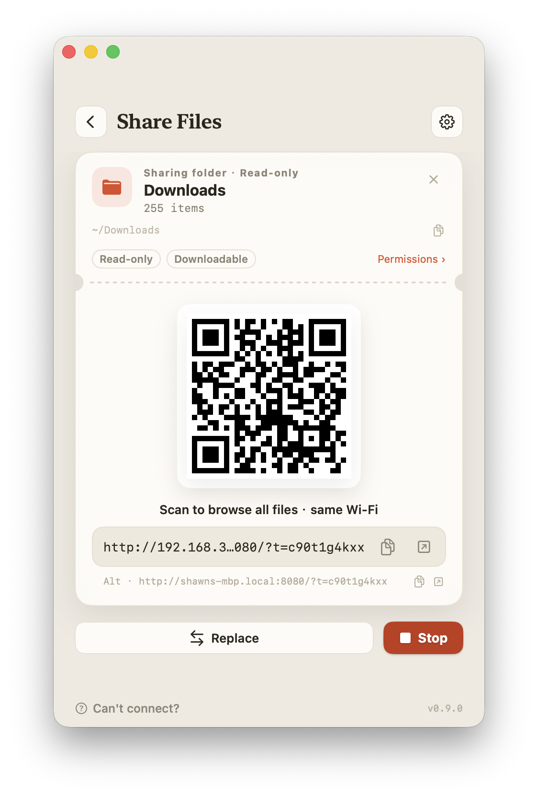
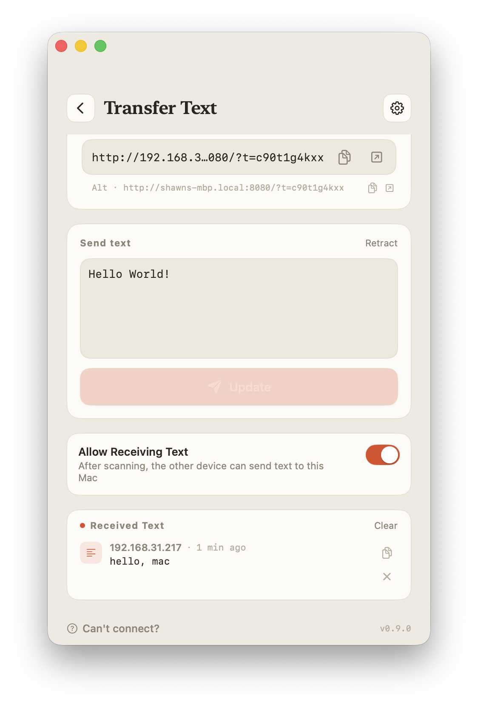

# LocalShare (LAN file sharing)

[简体中文](README_CN.md) | English

A small macOS tool that spins up a static file server so you can share specific files/folders from your Mac with other devices on the same local network.

<table>
  <tr>
    <td align="center"><br>Home</td>
    <td align="center"><br>Share Files</td>
    <td align="center"><br>Transfer Text</td>
  </tr>
</table>

## Features

- Share via QR code — scan with the Camera app to open in a browser
- Share multiple files / folders at once
- Serves HTML / PDF / video / images; previews Markdown / JSON / CSV right in the browser
- Optional guest upload (read-only by default) — send photos and documents from your phone back to the Mac
- Shows who's currently viewing (device name when it can be resolved, otherwise the IP)
- Optional "visible on current network only" — open on the current Wi-Fi only, unreachable from other networks the Mac is connected to
- Automatic updates (prompts when a new version is found; installs only after you confirm)
- `localshare` command line: bring up the window to share, or `--headless` to print the link and QR code in the terminal

## Why this app exists

- iPhone Safari can't open local HTML files directly — they need to be served from a static file server to preview
- When you don't want to actually move files to your phone via AirDrop/LocalSend, you just want to preview them there
- When you want to browse several files at once
- To share files with other people on the same LAN

## Usage

1. Open the app and drag files onto the window, or click "Choose Files or Folders".
2. Connect your phone to **the same Wi-Fi as the Mac**, then scan the QR code in the window with the Camera app.
3. If macOS shows a firewall prompt on first launch, click "Allow".

The QR code points to something like `http://192.168.x.x:8080/?t=<random-token>`: the link carries a one-time token, so whoever scans it gets in seamlessly, while anyone who only knows the IP:port cannot access it.

> ⚠️ Traffic is plain HTTP (unencrypted). That's fine on trusted networks like home or office; but on public Wi-Fi such as cafés or airports, others on the same network may be able to see what's transferred — don't share sensitive files there. When needed, turn on "visible on current network only" in the window to narrow the exposure.

## Terminal usage

In Settings → Command-Line Tool, click "Install". After that you can share from the terminal in one command:

```bash
localshare a.html b.pdf        # bring up the LocalShare window to share these files
localshare ~/Documents/report  # folders work the same; mix and match multiple items
localshare --headless ./dist   # no window — print the link and QR code in the terminal (Ctrl-C to stop)
```

## Download

https://github.com/rrbe/LocalShare/releases

## Notes

The app is ad-hoc signed, so **opening** it may be blocked by Gatekeeper (warning that it's "damaged" or "can't be opened").

- In System Settings → Privacy & Security → Security, find the prompt and click "Open Anyway"; or
- run the command below in the terminal to strip the quarantine attribute, then open the app normally:

```bash
xattr -dr com.apple.quarantine /Applications/LocalShare.app
```

## Credits

This project was inspired by:

- [localsend](https://github.com/localsend/localsend)
- [dufs](https://github.com/sigoden/dufs)
