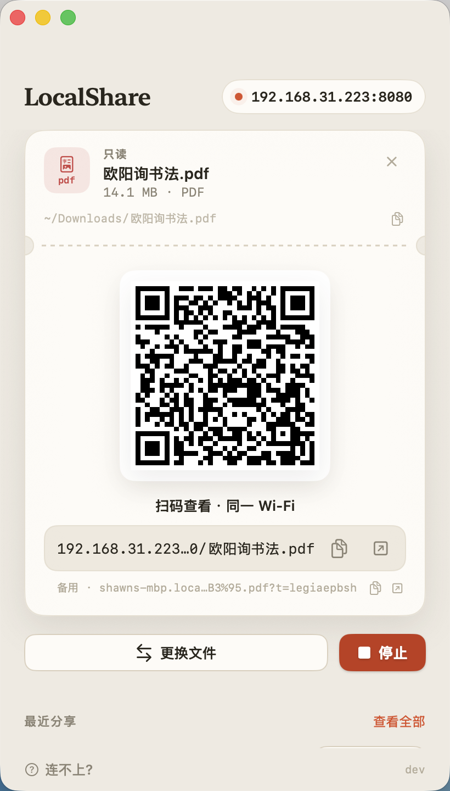

# LocalShare（局域网文件分享）

一个 macOS 小工具，分享你电脑上的特定文件/文件夹，在同一个局域网下的其他设备中访问

<p align="center">
  
</p>

## 功能

- 二维码分享，相机 app 扫一下浏览器中打开
- 支持 html\pdf\视频\图片 等

## 为什么有这个 app

- iPhone 并不支持 html 文件直接在 Safari 中打开

## 使用

1. 打开 app，点「选择文件夹/单个文件」。
2. 手机连上**与电脑相同的 WiFi**，用相机扫描窗口里的二维码。
3. 首次启动若系统弹出防火墙提示，点「允许」。

二维码地址形如 `http://192.168.x.x:8080/?t=随机令牌`：链接里带一次性令牌，扫码者无感进入，
单纯知道 IP:端口 的人无法访问。

## 开发 / 构建

```bash
swift build -c release   # 编译（首次会拉取 Swifter 依赖）
./build.sh               # 组装并 ad-hoc 签名 → dist/LocalShare.app
open dist/LocalShare.app
```

要求 macOS 13+、Xcode（含 Swift 工具链）。

## 注意事项

由于是 ad-hoc 签名而非 Apple 公证，**首次打开**可能被 Gatekeeper 拦截（提示「已损坏」或「无法打开」），可任选其一：

右键 `LocalShare.app` →「打开」，在弹窗里再点一次「打开」：

- 在「系统设置 → 隐私与安全性」找到拦截提示，点「仍要打开」；
- 或在终端执行下面这条去掉隔离属性，之后正常双击即可。

```bash
# 路径换成 .app 实际所在位置，例如拖进 /Applications 后即为 /Applications/LocalShare.app
xattr -dr com.apple.quarantine /path/to/LocalShare.app
```

其中 `-d` 删除属性、`-r` 递归整个 `.app` 包，`com.apple.quarantine` 是 macOS 给「从网络下载的文件」打的隔离标记——清掉它，系统就不再拦截。

